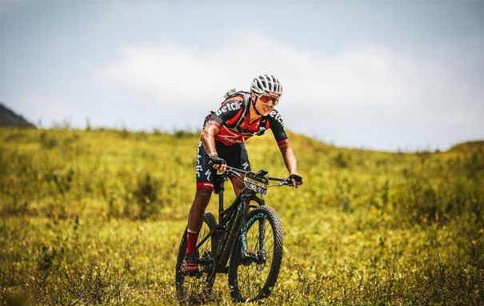
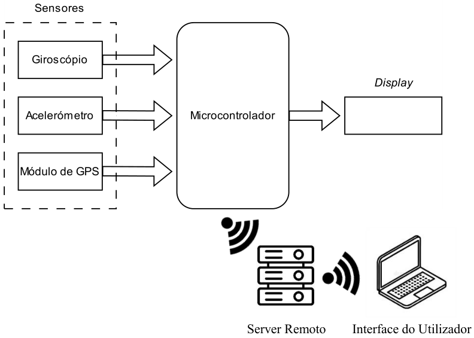

# Simple Navigation System for BTT

Este projeto tem como objetivo desenvolver o hardware e software para um sistema simples e acessível de navegação para bicicletas Todo-o-Terreno (BTT), que consiste na monitorização de variáveis como localização geográfica, direção e velocidade.

O sistema de navegação será baseado num microcontrolador, num giroscópio, num acelerómetro e num módulo de GPS para o processamento, medição de variáveis e apresentação da informação. Para além disso, este sistema irá armazenar as trajetórias percorridas de forma não volátil para consulta posterior.

## Enquadramento

Atualmente, a prática do BTT tem ganhado cada vez mais adeptos, impulsionada pela busca por atividades ao ar livre e por desafios físicos. No entanto, a navegação em trilhos pode ser difícil, especialmente em percursos não sinalizados ou em áreas de difícil acesso. A maioria dos ciclistas recorre a smartphones e dispositivos GPS comerciais para orientação e navegação, mas estes equipamentos podem ser caros, vulneráveis e ter um alto consumo de bateria, tornando-se inadequados para trilhas longas e condições adversas.
Este projeto visa fornecer uma alternativa acessível a estes dispositivos convencionais, permitindo que ciclistas naveguem e registem os seus percursos sem depender exclusivamente deles. A solução proposta inclui um display de baixo consumo com uma interface simples e eficiente que permitirá uma apresentação visível das informações sob luz solar intensa.

## Descrição do Projeto

Este projeto tem como objetivo desenvolver um protótipo de um sistema de navegação simples e acessível para BTT. A figura ilustra a arquitetura do projeto.

- O microcontrolador estará encarregue de processar os dados provenientes dos sensores, interpretando informações como direção, velocidade e trajetória percorrida. Será necessário desenvolver e aplicar algoritmos de processamento de sensores como filtragem para garantir leituras confiáveis.

- O sistema contará com um giroscópio e um acelerômetro para deteção de movimento e inclinação, para além de um módulo GPS para determinação da localização e cálculo da velocidade. Estes sensores serão conectados ao microcontrolador, que processará os dados recolhidos e os apresentará ao utilizador através do display.

- O sistema será capaz de armazenar as trajetórias percorridas de forma não volátil, permitindo que o ciclista faça uma consulta posterior dos percursos realizados. O sistema fará um registo periódico dos dados de localização na memória flash do microcontrolador. Complementando o armazenamento local, o sistema terá telemetria para transmissão de dados em tempo real. Esta comunicação será feita através do protocolo MQTT. Este protocolo é amplamente usado em aplicações de IoT e permitirá a transmissão eficiente de informações como localização geográfica, velocidade e direção para um servidor remoto.

- A apresentação das informações será feita por meio de um display de baixo consumo, garantindo boa visibilidade sob luz solar direta. O ciclista poderá visualizar dados essenciais como velocidade, direção e trajetória percorrida, de forma clara e intuitiva. Adicionalmente, a interface permitirá a consulta de registos de posições guardadas na flash, possibilitando ao utilizador visualizar percursos anteriores diretamente no dispositivo.

## Seleção dos componentes necessários ao projeto

O desenvolvimento do projeto vai exigir uma escolha ponderada dos componentes de hardware, dado que ausência de critérios para seleção do hardware pode complicar desnecessariamente o projeto ou tornar desenvolvimento de algumas partes do projeto inviável, sendo esta uma decisão importante. Alguns dos critérios a usar serão fatores como precisão dos sensores, eficiência energética e facilidade de uso.

## Discussão dos problemas a resolver e possíveis abordagens

- Processamento dos dados dos sensores: Tendo em conta que os sensores de inercia e o módulo de GPS trazem medidas com imprecisões e ruído (medidas sem filtro são medidas brutas), tem de se implementar algoritmos de filtragem e fusão sensorial para garantir leituras mais confiáveis. Sendo assim, devem ser pesquisadas alguns destes algoritmos e escolher o mais adequado para combinar os dados dos sensores e minimizar erros de medição.

- Desenvolvimento da interface: Para ter uma interface de fácil leitura e para o sistema consumir pouca energia, é necessário fazer uma escolha viável do display. Critérios como visibilidade, consumo de energia e a responsividade serão importantes na seleção do componente.

- Autonomia: Como o sistema será utilizado em bicicletas, a autonomia da bateria é algo muito importante. O microcontrolador e os sensores devem operar com baixo consumo de energia, e a alimentação poderá ser feita por baterias de iões de lítio recarregáveis.
